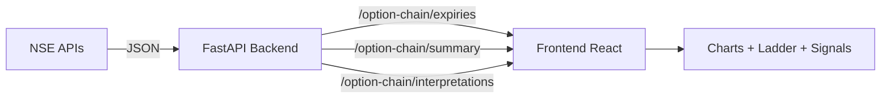
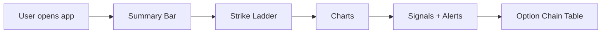
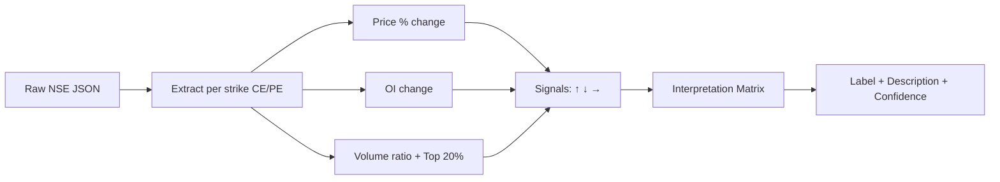

# Optionlens - Flow Diagrams

## 1) Data Flow

```mermaid
flowchart LR
  A[NSE APIs] -->|JSON| B[FastAPI Backend]
  B -->|/option-chain/expiries| C[Frontend React]
  B -->|/option-chain/summary| C
  B -->|/option-chain/interpretations| C
  C --> D[Charts + Ladder + Signals]
```

## 2) User Flow

```mermaid
flowchart LR
  U[User opens app] --> S[Summary Bar]
  S --> L[Strike Ladder]
  L --> G[Charts]
  G --> M[Signals + Alerts]
  M --> T[Option Chain Table]
```

## 3) Rule Engine Flow

```mermaid
flowchart LR
  J[Raw NSE JSON] --> P[Extract per strike CE/PE]
  P --> D1[Price % change]
  P --> D2[OI change]
  P --> D3[Volume ratio + Top 20%]
  D1 --> S[Signals: ↑ ↓ →]
  D2 --> S
  D3 --> S
  S --> R[Interpretation Matrix]
  R --> O[Label + Description + Confidence]
```
